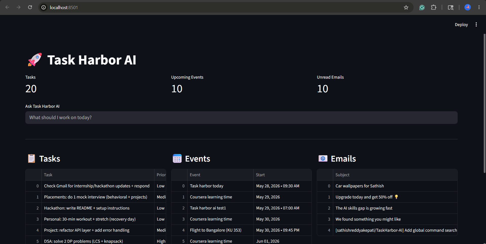
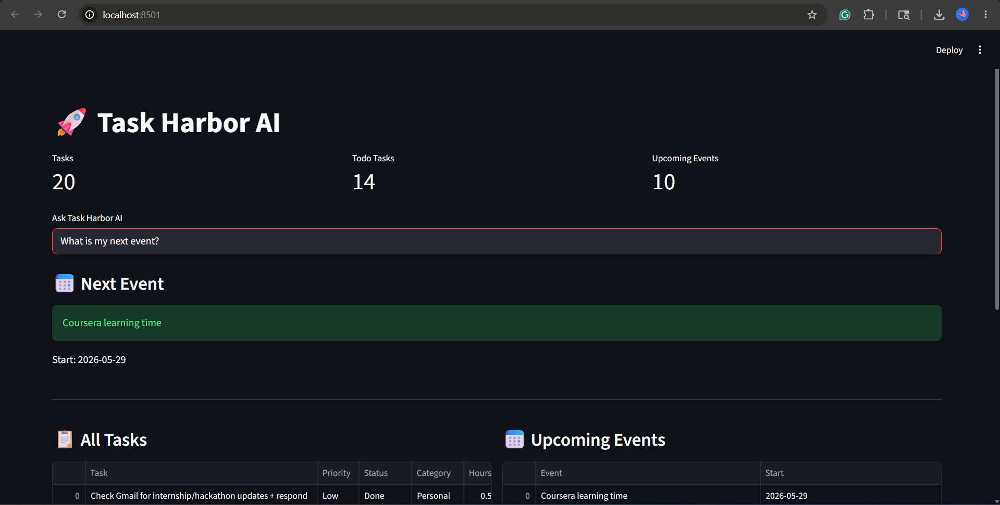
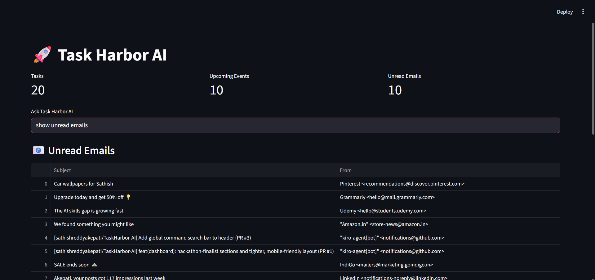
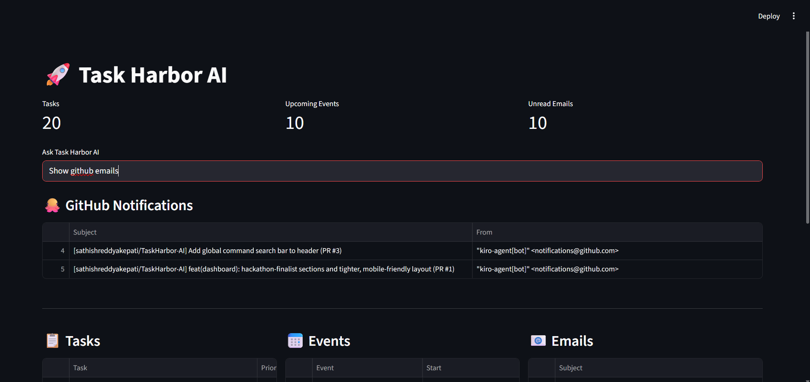
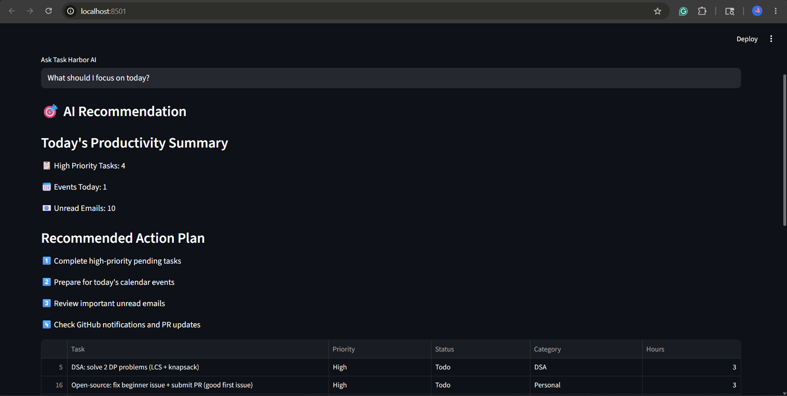

# 🚀 Task Harbor AI

Task Harbor AI is an intelligent productivity dashboard that helps users manage tasks, schedules, and important communications from a single interface.

Built during the Coral Hackathon.

---

## 🎯 Problem Statement

Students and professionals use multiple productivity tools every day:

* Notion for tasks
* Google Calendar for schedules
* Gmail for updates and notifications

Constant context switching makes it difficult to know what deserves attention first.

---

## 💡 Solution

Task Harbor AI brings tasks, calendar events, and emails into one dashboard and provides intelligent recommendations about what to focus on next.

---

## ✨ Features

### 📋 Task Management

* Fetch tasks from Notion
* View all tasks in one place
* Filter High Priority tasks
* Filter Todo tasks
* Category-based task filtering

### 📅 Google Calendar Integration

* View upcoming events
* View today's schedule
* Ask:

  * "What meetings do I have today?"
  * "Show my calendar events"

### 📧 Gmail Integration

* View unread emails
* Display sender information
* Track important updates

### 🐙 GitHub Notification Tracking

* Filter GitHub notifications from Gmail
* Quickly identify PR and repository updates

### 🎯 AI Recommendation Engine

Combines:

* Tasks
* Calendar Events
* Emails

To provide recommendations such as:

> What should I focus on today?

---

## 🏗️ Tech Stack

* Python
* Streamlit
* Notion API
* Google Calendar API
* Gmail API
* Coral

---

## 📸 Screenshots

### Dashboard

### Calendar Integration

### Gmail Integration

### GitHub Notifications

### AI Recommendation Engine

---

## 🚧 Current Status

### Completed

* Notion Integration
* Google Calendar Integration
* Gmail Integration
* GitHub Notification Filtering
* AI Recommendation Engine
* Coral Installation & Setup

### In Progress

* Coral-powered recommendation workflow
* Dashboard UI improvements
* Demo video
* Submission assets

---

## 🚀 Future Improvements

* Natural language task planning
* Smarter recommendation engine
* Additional productivity integrations
* Enhanced dashboard analytics

---

## 👨‍💻 Builder

Akepati Sathish Reddy

Built as a solo project during the Coral Hackathon.

---

## 🏴‍☠️ Hackathon Journey

### Day 1

* Project planning
* Notion integration setup

### Day 2

* Dashboard foundation
* Task visualization

### Day 3

* Calendar integration exploration
* UI improvements

### Day 4

* Google Calendar Integration
* Gmail Integration
* GitHub Notification Filtering
* AI Recommendation Engine
* Coral setup and experimentation

---

Built in public during the Coral Hackathon.

@withcoral @WeMakeDevs
