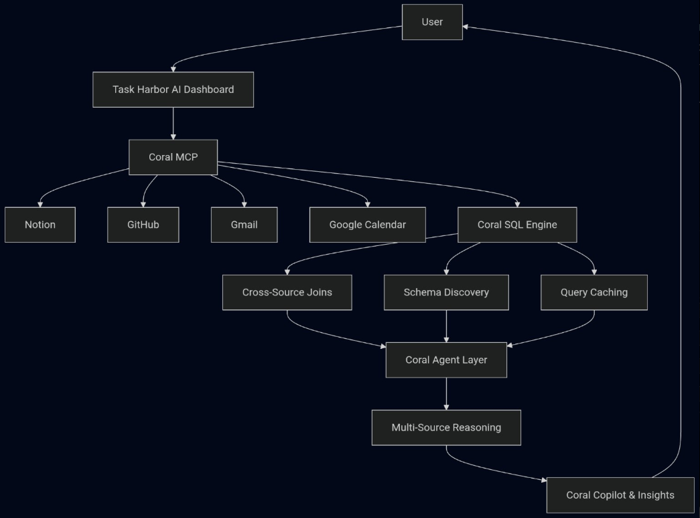
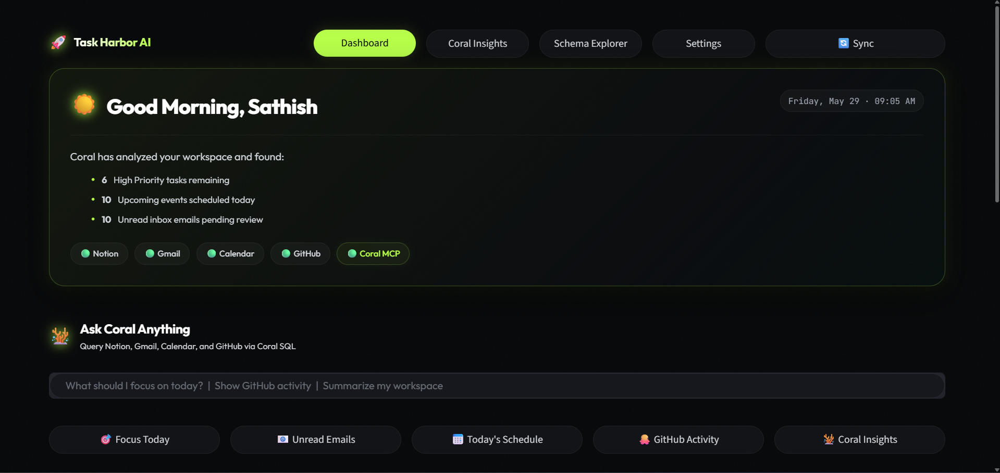
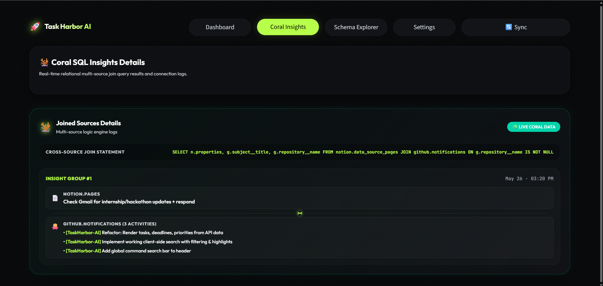
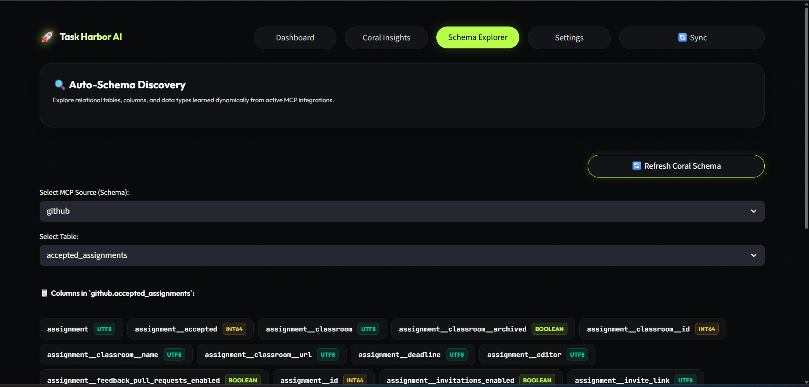

# 🚀 Task Harbor AI

<p align="center">
  <b>AI-Powered Productivity Workspace built with Coral MCP & Coral SQL</b>
</p>

<p align="center">
  Unifying Notion, GitHub, Gmail, and Google Calendar into a single intelligent workspace.
</p>

---

# 🎥 Demo Video

📺 Demo: https://youtu.be/taSizqZwlJ0

---

# 🌟 Overview

Task Harbor AI is an intelligent productivity workspace that helps users manage tasks, schedules, emails, and development activity from a single dashboard.

Instead of constantly switching between applications, Task Harbor AI uses Coral MCP and Coral SQL to connect multiple data sources and transform fragmented information into actionable insights.

The platform combines information from:

* 📝 Notion
* 🐙 GitHub
* 📧 Gmail
* 📅 Google Calendar

and delivers AI-powered recommendations through a unified interface.

---

# ❗ Problem Statement

Modern productivity workflows are scattered across multiple platforms.

A typical user needs to:

* Check tasks in Notion
* Review GitHub activity
* Read Gmail updates
* Monitor calendar schedules

This constant context switching leads to:

* Reduced productivity
* Missed priorities
* Information overload
* Lack of unified visibility

There is no simple way to understand how information across these systems relates to each other.

---

# 💡 Solution

Task Harbor AI creates a unified intelligence layer using Coral MCP and Coral SQL.

The system:

* Connects multiple productivity tools
* Correlates data across platforms
* Discovers schemas dynamically
* Generates AI-powered recommendations
* Provides a single workspace for decision-making

By leveraging Coral's capabilities, Task Harbor AI transforms disconnected data into actionable productivity insights.

---

# 🏗️ Architecture



### System Flow

```text
User
 │
 ▼
Task Harbor AI Dashboard
 │
 ▼
Coral MCP
 │
 ├── Notion
 ├── GitHub
 ├── Gmail
 └── Google Calendar
 │
 ▼
Coral SQL Engine
 │
 ├── Cross-Source Joins
 ├── Schema Discovery
 └── Query Caching
 │
 ▼
Task Harbor AI Agent
 │
 ▼
Multi-Source Reasoning
 │
 ▼
Coral Copilot & Insights
 │
 ▼
User
```

---

# 🪸 Why Coral?

Traditional integrations require:

* Separate APIs
* Multiple authentication systems
* Manual data correlation
* Custom connectors

Task Harbor AI uses Coral MCP and Coral SQL to provide:

✅ Unified access to multiple sources

✅ Cross-source relational querying

✅ Dynamic schema exploration

✅ Query caching

✅ Multi-source reasoning

✅ Faster development and integration

---

# 🪸 Coral Features Implemented

## 1. Coral MCP Integration

Task Harbor AI uses Coral MCP to connect:

* Notion
* GitHub
* Gmail
* Google Calendar

This provides a single interface for accessing multiple productivity platforms.

---

## 2. Coral SQL

All workspace intelligence is built on top of Coral SQL queries.

Used for:

* Data retrieval
* Insights generation
* Cross-source analysis
* Schema exploration

---

## 3. Cross-Source Joins

Task Harbor AI performs live cross-source joins between:

```text
Notion Tasks
      ↔
GitHub Notifications
```

This enables users to understand how development activity relates to ongoing work.

---

## 4. Schema Discovery

The Schema Explorer dynamically discovers:

* Sources
* Tables
* Columns
* Sample records

without requiring hardcoded schemas.

---

## 5. Query Caching

Frequently executed Coral queries are cached to:

* Reduce latency
* Improve dashboard responsiveness
* Minimize repeated requests

---

## 6. Multi-Source Reasoning

Task Harbor AI combines information from multiple sources to generate:

* Focus recommendations
* Productivity insights
* Workspace summaries

---

# 📊 Coral Feature Mapping

| Coral Capability       | Task Harbor AI Implementation               |
| ---------------------- | ------------------------------------------- |
| Coral MCP              | Notion, GitHub, Gmail, Calendar Integration |
| Coral SQL              | Workspace Queries & Analytics               |
| Cross-Source Joins     | Notion ↔ GitHub Correlation                 |
| Schema Discovery       | Dynamic Schema Explorer                     |
| Query Caching          | Cached Coral Queries                        |
| Multi-Source Reasoning | Coral Copilot Recommendations               |

---

# ✨ Features

## 🪸 Coral Command Center

Natural language workspace interaction.

Users can:

* View priorities
* Check schedules
* Review GitHub activity
* Access workspace insights

---

## 🧠 Coral Copilot

AI-powered recommendations generated from multiple connected data sources.

Provides:

* Priority suggestions
* Context-aware reasoning
* Productivity guidance

---

## 🔗 Coral SQL Insights

Visualizes relationships discovered through Coral SQL joins.

Shows how:

* Tasks
* Notifications
* Development activity

connect across systems.

---

## 📊 Schema Explorer

Explore:

* Sources
* Tables
* Columns
* Sample Data

using Coral's schema discovery capabilities.

---

## 📧 Email Overview

Access important Gmail information directly from the dashboard.

---

## 📅 Calendar Insights

Monitor upcoming schedules and availability.

---

## 🐙 GitHub Activity

Track development activity without leaving the workspace.

---

# 📸 Screenshots

## Dashboard



---

## Coral SQL Insights



---

## Schema Explorer



---

# ⚙️ Tech Stack

## Frontend

* Streamlit
* HTML
* CSS

## Backend

* Python

## Coral Layer

* Coral MCP
* Coral SQL

## Integrations

* Notion
* GitHub
* Gmail
* Google Calendar

---

# 🔄 How It Works

### Step 1

User opens Task Harbor AI.

### Step 2

Coral MCP connects to external services.

### Step 3

Coral SQL retrieves and analyzes data.

### Step 4

Cross-source joins correlate related information.

### Step 5

Schema discovery dynamically explores connected sources.

### Step 6

Task Harbor AI Agent performs multi-source reasoning.

### Step 7

Insights are displayed through Coral Copilot and workspace dashboards.

---

# 📂 Project Structure

```text
task-harbor-ai/
│
├── app_v2.py
├── services/
│   └── coral_agent.py
│
├── docs/
│   ├── architecture.png
│   ├── dashboard.png
│   ├── insights.png
│   └── schema.png
│
├── requirements.txt
└── README.md
```

---

# 🚀 Installation

## Clone Repository

```bash
git clone https://github.com/sathishreddyakepati/task-harbor-ai.git
cd task-harbor-ai
```

## Create Virtual Environment

```bash
python -m venv venv
```

## Activate Environment

### Windows

```bash
venv\Scripts\activate
```

### Linux / macOS

```bash
source venv/bin/activate
```

## Install Dependencies

```bash
pip install -r requirements.txt
```

## Run Application

```bash
streamlit run app_v2.py
```

---

# 📈 Future Improvements

* Additional productivity integrations
* Autonomous planning workflows
* Personalized recommendation engine
* Enhanced Coral-powered analytics
* Advanced agent capabilities

---

# 🙏 Acknowledgements

Built for the Coral Hackathon.

Special thanks to:

* Coral
* WeMakeDevs
* Open Source Community

---

# 👨‍💻 Author

**Akepati Sathish Reddy**

GitHub: https://github.com/sathishreddyakepati

Demo Video: https://youtu.be/taSizqZwlJ0
